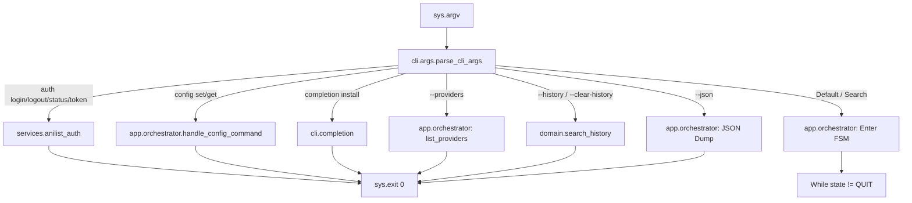
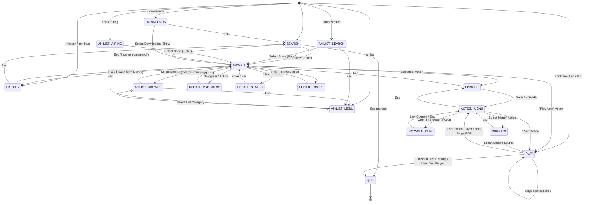
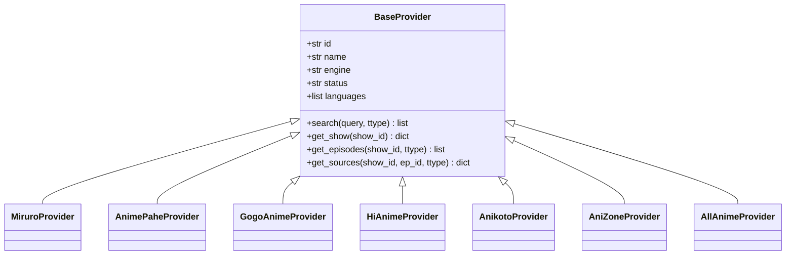
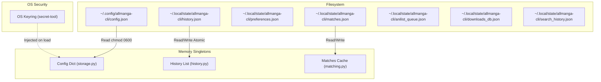

# ALLMANGA-CLI TECHNICAL ARCHITECTURE & FLOW MANUAL

> **CONFIDENTIAL / ENGINEERING SPECIFICATION**  
> **Source of Truth**: Current local repository working tree (`/home/tiru/projects/agy/AllManga-Workspace/allmanga-cli`).  
> **Purpose**: Complete reverse-engineering and end-to-end trace of `allmanga-cli` for future refactoring, module decomposition, and safe maintenance without losing business logic.

---

## 1. Executive Overview

`allmanga-cli` is a command-line interface and terminal user interface (TUI) application written in Python (3.9+) for searching, browsing, playing, tracking, and downloading anime across multiple scraping/API providers (Miruro, AnimePahe, GogoAnime, HiAnime, KickAssAnime, YugenAnime, Anikoto, AniZone, MKISSA/AllAnime).

### Key Architectural Pillars
1. **Interactive TUI Finite State Machine (FSM)**: A cyclic state machine managing navigation between search, show details, episode selection, playback menus, mirror picker, and modals.
2. **Multi-Provider Stream Resolvers**: Dynamic extraction pipeline supporting direct video links (`.m3u8`, `.mp4`), extractors (RapidCloud, StreamWish, MegaCloud, VidStreaming, Filemoon), and fallback subprocess scrapers (`yt-dlp`).
3. **Decoupled Playback Engine**: Dual-runtime architecture:
   - **Desktop**: MPV JSON IPC client (`socket` / Windows named pipe) supporting auto-resume, real-time OSD overlays, and frame-accurate AniSkip OP/ED timestamp skipping.
   - **Android / Termux**: Android intent launcher dispatching streams to MPV Android (`xyz.mpv.rex` / `is.xyz.mpv`) or VLC via `am start`.
4. **Hybrid Persistence & Security**: OS Keyring (`secret-tool`) integration for private OAuth tokens with automatic fallback to chmod `0600` JSON files on Termux, alongside atomic JSON writes for history, favorites, downloads, and matches.
5. **Three-Tier Metadata & Tracking Engine**:
   - **Local History**: Zero-network offline watch progress and resume timestamps.
   - **Public AniList GraphQL**: Unauthenticated public metadata enrichment (synonyms, airing countdowns, scores, banners).
   - **Private AniList Scrobbling**: Authenticated user watch list synchronization, score updating, and offline-queued retry workers.

---

## 2. Project & Module Map

```
allmanga_cli/
├── __init__.py                 # Package version (__version__ = "1.0.0")
├── __main__.py                 # `python -m allmanga_cli` entrypoint -> cli.main.run()
├── app.py                      # Historical single-file entrypoint (re-exports)
├── app_core.py                 # Pure re-export facade & top-level wiring (241 symbols)
├── context.py                  # Runtime singletons (FLAGS, UiState, MachineState, UI contexts)
│
├── cli/                        # Command-line parsing and entry
│   ├── main.py                 # Outer CLI runner, crash log capture, signal restore
│   ├── args.py                 # Argument parser dispatcher & legacy compatibility
│   ├── args_common.py          # Shared argparse groups (search, playback, tracking, output)
│   ├── args_subcommands.py     # Subcommand parsers (auth, config, providers, anilist, completion)
│   └── completion.py           # Dynamic shell completion generator (bash, zsh, fish)
│
├── app/                        # FSM State Handlers & UI Controllers
│   ├── orchestrator.py         # Main FSM loop, signal trap, CLI pre-dispatchers
│   ├── search.py               # SEARCH and HISTORY state controllers
│   ├── search_coordinator.py   # Multi-threaded live provider & AniList search workers
│   ├── details.py              # SHOW_DETAILS state controller & header builder
│   ├── details_modals.py       # Modal controllers: UPDATE_PROGRESS, UPDATE_STATUS, UPDATE_SCORE
│   ├── playback.py             # Facade re-exporting player, menu, and episode handlers
│   ├── playback_player.py      # PLAY state controller: desktop/android playback lifecycles
│   ├── playback_menu.py        # ACTION_MENU and MIRRORS state controllers
│   ├── playback_episodes.py    # EPISODE picker state controller & formatting
│   ├── anilist.py              # ANILIST_MENU, ANILIST_BROWSE, ANILIST_SEARCH, ANILIST_AIRING states
│   └── downloads.py            # DOWNLOADS state controller & offline catalog browser
│
├── core/                       # Low-level systems, networking, and APIs
│   ├── api.py                  # Cloudflare-bypassing HTTP requests, API session pools
│   ├── anilist.py              # AniList GraphQL queries, mutations, browse lists, caches
│   ├── anilist_fallback.py     # Secondary AniList endpoints and schema fallbacks
│   ├── enrichment.py           # Cross-provider metadata merging & title matching
│   ├── processes.py            # Active subprocess registry & hard termination handlers
│   ├── reporting.py            # Centralized debug logging, warnings, and crash reporter
│   ├── storage.py              # High-level state persistence, history, config, downloads DB
│   ├── streams.py              # Background stream resolve thread & generation pools
│   ├── terminal.py             # Raw ANSI terminal reset, cursor controls, dimensions
│   └── tmdb.py                 # TMDB API client for show posters and backdrop artwork
│
├── services/                   # Business domain services
│   ├── catalog.py              # Multi-provider catalog dispatcher & episode resolvers
│   ├── anilist_auth.py         # OAuth login, token masking, keyring vs config status
│   ├── anilist_queue.py        # Offline AniList mutation queue & retry workers
│   └── normalize/              # Provider-to-Standard schema normalizers (allanime, anikoto, etc.)
│
├── domain/                     # Pure domain logic and models
│   ├── metadata.py             # Metadata line formatters, badges, years, progress labels
│   ├── history.py              # History entry management, catalog refreshes, sorting
│   ├── episodes.py             # Episode string parsing, ranges, Roman numerals, sorting
│   ├── matching.py             # Title matching algorithms (exact, fuzzy, token distance)
│   ├── tracking.py             # AniList list status mapping & progress calculations
│   ├── titles.py               # Title word wrapping, truncation, and subtitle extractors
│   ├── airing.py               # Airing schedule calculation & countdown formatting
│   └── search_history.py       # CLI search query history persistence (FIFO 50)
│
├── playback/                   # Media player runners and IPC
│   ├── engine.py               # High-level playback dispatcher, redraws, and OSD formatters
│   ├── desktop.py              # Desktop player launcher (MPV IPC / VLC)
│   ├── android.py              # Android intent dispatcher (Termux `am start`)
│   ├── mpv.py                  # MPV command builder, socket creation, config generator
│   └── ipc.py                  # Unix Domain Socket & Windows Named Pipe JSON-RPC client
│
├── media/                      # Stream extractors and media helpers
│   ├── download.py             # Multi-threaded episode downloader (aria2c / yt-dlp / ffmpeg)
│   ├── aniskip.py              # AniSkip REST client for intro/outro skip timestamps
│   ├── resolver.py             # Stream URL extractor & mirror tester
│   ├── sources.py              # Stream mirror priorities and extractor mappings
│   └── urls.py                 # Frontend URL generators, browser openers, text redactors
│
├── providers/                  # Streaming Site Extractors & Scrapers
│   ├── registry.py             # Dynamic provider registration & capabilities registry
│   ├── base.py                 # BaseProvider abstract class definition
│   ├── miruro.py               # Miruro API / Consumet provider
│   ├── allanime.py             # AllAnime GraphQL / Mkissa API provider
│   ├── anikoto.py              # Anikoto scraper & extractor
│   ├── anizone.py              # AniZone provider
│   ├── animepahe.py            # AnimePahe API/Kwik extractor
│   ├── gogoanime.py            # GogoAnime / Vidstreaming scraper
│   ├── hianime.py              # HiAnime / Megacloud scraper
│   ├── kickassanime.py         # KickAssAnime extractor
│   └── yugenanime.py           # YugenAnime embed scraper
│
├── state/                      # Raw file paths, permission locks, and atomic IO
│   ├── paths.py                # Platform-specific paths (~/.config, ~/.local/state, Windows AppData)
│   ├── config.py               # Config JSON schema defaults & auto-migration engine
│   ├── secrets.py              # OS secret-tool wrapper
│   ├── preferences.py          # User preferences dict operations
│   ├── history.py              # History serialization & atomic disk writes
│   └── matches.py              # Provider-to-AniList ID pairing serialization
│
├── ui/                         # Presentation Layer (TUI)
│   ├── picker.py               # Interactive ANSI TUI selector (fuzzy filter, scrolling, keys)
│   ├── display.py              # Terminal raw mode, ANSI helpers, loading ticker
│   ├── info_panel.py           # Show metadata header cards & preview panel formatters
│   ├── modals.py               # TUI Confirmation Dialogs (Link Show, Match Title)
│   ├── player_screen.py        # ASCII art player dashboard & live playback HUD
│   ├── poster.py               # Terminal image rendering (Kitty, Sixel, iTerm2, Überzug)
│   ├── spinner.py              # Animated UTF-8 spinners (braille, dots, line, pulse)
│   ├── help.py                 # Contextual keybinding legend builders
│   ├── colors.py               # ANSI color palette & formatting utilities
│   └── terminal.py             # Alternate screen buffers & cursor visibility guards
│
└── brain/                      # Intelligent routing, heuristic fallback, title parsing
    ├── core/engine.py          # Unified title parsing engine & candidate scorer
    ├── parser/titles.py        # Anime season/part/cour regex extractors
    └── router/selector.py      # Provider health-aware fallback router
```

---

## 3. Complete Startup Lifecycle

The following sequence traces the exact execution path when a user executes `allmanga-cli`:

```
User Terminal Command: `allmanga-cli anikoto search "slime" --debug`
  │
  ▼
allmanga_cli/cli/main.py::run()
  │  ├── Installs global SIGINT signal handler (`_force_exit`)
  │  └── Calls app_core.main() inside try/except block
  │
  ▼
allmanga_cli/app/orchestrator.py::main()
  │
  ├── 1. Argument Parsing:
  │      `args, pa = allmanga_cli.cli.args.parse_cli_args(sys.argv[1:])`
  │      - Parses subcommands (`auth`, `config`, `completion`, `<provider>`)
  │      - Resolves positional queries and playback flags (`--quality`, `--dub`, `--binge`)
  │
  ├── 2. Early Command Interception (Exits before TUI):
  │      - `completion`: Outputs shell script -> `sys.exit(0)`
  │      - `config`: Executes `handle_config_command()` -> `sys.exit(0)`
  │      - `--history` / `--clear-history`: Prints/clears query list -> `sys.exit(0)`
  │      - `--providers`: Prints formatted provider registry table -> `sys.exit(0)`
  │      - `auth [login|logout|status|token]`: Executes secret operations -> `sys.exit(0)`
  │      - `--json`: Outputs raw JSON search payload -> `sys.exit(0)`
  │
  ├── 3. Runtime Dependency Check:
  │      `app_core.check_deps()` -> verifies `mpv` (or player alternative) exists on PATH.
  │
  ├── 4. Configuration & Keyring Loading:
  │      `cfg = allmanga_cli.core.storage.load_config()`
  │      - Reads `~/.config/allmanga-cli/config.json`
  │      - Runs `migrate_config_keys(cfg)` (auto-updates legacy keys: `auto_track` -> `sync`)
  │      - Queries `secret-tool` for `anilist_token`; injects into memory if present
  │      - Sanitizes `config.json` on disk to ensure tokens never leak in plaintext
  │
  ├── 5. Global Flag Synchronization:
  │      - `FLAGS.debug_mode = bool(args.debug)`
  │      - `FLAGS.incognito_mode = bool(args.incognito)`
  │      - `FLAGS.sync_force_on = bool(args.sync and not args.no_sync)`
  │      - `FLAGS.sync_force_off = bool(args.no_sync)`
  │      - `FLAGS.show_image = bool(args.cover if args.cover is not None else cfg.get("cover"))`
  │
  ├── 6. State & Context Initialization:
  │      - Instantiates `ui = UiState()`
  │      - Instantiates `ms = MachineState(query_str="slime", just_searched=True)`
  │      - Sets active provider: `ui.ui_provider_ctx = "anikoto"`
  │      - Sets active audio: `ui.ui_ttype_ctx = "sub"`
  │      - Flushes offline write queue if logged in: `retry_queued_anilist_writes()`
  │
  ├── 7. FSM Entry Point:
  │      Initial state set: `state = "SEARCH"`
  │      (or `"ANILIST_MENU"`, `"HISTORY"`, `"DOWNLOADS"`, `"PLAY"` if launched via shortcuts)
  │
  ▼
FSM Execution Loop (`while state != "QUIT":`)
  │  Dispatches to corresponding `handle_<state>_state()` function in `allmanga_cli/app/`
  │
  ▼
Exit & Cleanup (`cli/main.py::run() -> finally:`)
  ├── `app_core._ipc_player.quit()` (terminates active MPV daemon)
  ├── `app_core.kill_active_subprocesses()` (kills child yt-dlp/ffmpeg processes)
  ├── `app_core.restore_terminal()` (restores termios attributes, show cursor, disable alt buffer)
  └── `app_core.flush_anilist_writes()` (persists unwritten tracking events to disk)
```

---

## 4. CLI Dispatch & Subcommand Routing Flow



---

## 5. Reverse-Engineered FSM State Machine

The entire interactive lifecycle is driven by a single loop in `allmanga_cli/app/orchestrator.py` executing over 16 explicit states:



### Complete State Specification Table

| State Name | Handler Module & Function | Primary Data Inputs | Screen Rendering | Key Transitions |
| :--- | :--- | :--- | :--- | :--- |
| **`SEARCH`** | `app.search::handle_search_state` | `ms.query_str`, `ui.ui_provider_ctx` | Live search input & search result picker list | `Enter` $\to$ `DETAILS`<br>`Esc` $\to$ `QUIT`<br>`Tab` $\to$ Switch Sub/Dub<br>`Ctrl+R` $\to$ Change Provider |
| **`HISTORY`** | `app.search::handle_history_state` | `storage.load_history()` | Reverse-chronological watch history list | `Enter` $\to$ `DETAILS`<br>`Esc` $\to$ `SEARCH`<br>`d` $\to$ Delete Entry |
| **`DOWNLOADS`** | `app.downloads::handle_downloads_state` | `storage.load_downloads_db()` | Local filesystem downloaded shows catalog | `Enter` $\to$ `DETAILS`<br>`Esc` $\to$ `SEARCH`<br>`d` $\to$ Delete Downloaded File |
| **`ANILIST_MENU`** | `app.anilist::handle_anilist_menu_state` | `cfg["anilist_token"]` | Categories (Watching, Planning, Airing, Search) | `Enter` $\to$ `ANILIST_BROWSE` / `ANILIST_SEARCH`<br>`Esc` $\to$ `QUIT` |
| **`ANILIST_BROWSE`**| `app.anilist::handle_anilist_browse_state`| Category string (`CURRENT`, `COMPLETED`, etc.) | User list media cards | `Enter` $\to$ `DETAILS`<br>`Esc` $\to$ `ANILIST_MENU`<br>`s` $\to$ Sort Mode, `r` $\to$ Reverse Sort |
| **`ANILIST_SEARCH`**| `app.anilist::handle_anilist_search_state`| `ms.query_str`, `token` | AniList global anime search results | `Enter` $\to$ `DETAILS`<br>`Esc` $\to$ `ANILIST_MENU` |
| **`ANILIST_AIRING`**| `app.anilist::handle_anilist_airing_state`| Airing schedule query results | Upcoming releasing episodes & countdowns | `Enter` $\to$ `DETAILS`<br>`Esc` $\to$ `ANILIST_MENU` |
| **`DETAILS`** | `app.details::handle_details_state` | `ui.ui_show_ctx`, `ui.ui_ttype_ctx` | Large metadata header card & Action Picker | `Play Next` $\to$ `PLAY`<br>`Episodes` $\to$ `EPISODE`<br>`Progress` $\to$ `UPDATE_PROGRESS`<br>`Status` $\to$ `UPDATE_STATUS`<br>`Score` $\to$ `UPDATE_SCORE`<br>`Esc` $\to$ Previous Source Screen |
| **`UPDATE_PROGRESS`**| `app.details_modals::handle_update_progress_state`| `ui.ui_show_ctx`, `episode_ids` | Numeric episode picker (`Watched X/Y`) | `Enter` $\to$ Sync/Save Progress $\to$ `DETAILS`<br>`Esc` $\to$ `DETAILS`<br>`Ctrl+R` $\to$ Flip Sort |
| **`UPDATE_STATUS`**| `app.details_modals::handle_update_status_state`| `ui.ui_show_ctx` | Status list (Watching, Completed, Dropped) | `Enter` $\to$ Sync AniList Status $\to$ `DETAILS`<br>`Esc` $\to$ `DETAILS` |
| **`UPDATE_SCORE`** | `app.details_modals::handle_update_score_state` | `ui.ui_show_ctx` | 1-10 Score picker | `Enter` $\to$ Sync AniList Score $\to$ `DETAILS`<br>`Esc` $\to$ `DETAILS` |
| **`EPISODE`** | `app.playback_episodes::handle_episode_state` | `ui.ui_show_ctx`, `episode_ids` | Formatted episode catalog list | `Enter` $\to$ `ACTION_MENU`<br>`Esc` $\to$ `DETAILS`<br>`o` $\to$ Toggle ASC/DESC order |
| **`ACTION_MENU`** | `app.playback_menu::handle_action_menu_state` | `ms.current_ep`, `ui.ui_show_ctx` | Actions: Play, Select Mirror, Mark Watched | `Play` $\to$ `PLAY`<br>`Select Mirror` $\to$ `MIRRORS`<br>`Open in Browser` $\to$ `BROWSER_PLAY`<br>`Esc` $\to$ `EPISODE` |
| **`MIRRORS`** | `app.playback_menu::handle_mirrors_state` | `ep_data`, `core.streams.all_streams` | Live mirror list with background resolver counter | `Enter` $\to$ Select stream $\to$ `PLAY`<br>`Tab` $\to$ Toggle preferred server<br>`Esc` $\to$ `ACTION_MENU` |
| **`BROWSER_PLAY`**| `app.playback_menu::handle_browser_play_state`| `ep_data["episode"]["sourceUrls"]` | Raw link list to launch in default browser | `Enter` $\to$ Launch URL $\to$ `ACTION_MENU`<br>`Esc` $\to$ `ACTION_MENU` |
| **`PLAY`** | `app.playback_player::handle_play_state` | `ms.selected_stream`, `ms.current_ep` | Launches MPV subprocess / Android intent | Returns `EOF`/`QUIT` $\to$ `ACTION_MENU`<br>Returns `NEXT` $\to$ `PLAY` (Binge) |

---

## 6. UI Architecture & Terminal Rendering

The presentation layer is implemented without heavy third-party TUI frameworks (such as curses or textual); it operates directly over ANSI escape codes, terminal raw mode, and dynamic POSIX `termios` control.

```
                  ┌──────────────────────────────────────────────┐
                  │              UI RENDER PIPELINE              │
                  └──────────────────────┬───────────────────────┘
                                         │
                                         ▼
                 allmanga_cli/ui/picker.py::tui_pick()
                                         │
            ┌────────────────────────────┼────────────────────────────┐
            │                            │                            │
            ▼                            ▼                            ▼
   Top Header Component         Metadata Card Component        List / Options Engine
   (ui.poster::render_top)      (ui.info_panel::build)       (ui.picker::_render_visible)
            │                            │                            │
            ▼                            ▼                            ▼
   - Kitty Graphics             - Title (Romaji/English)     - Visible Slice Calculator
   - Sixel Protocol             - Status Badge (AL / Airing) - Custom Hints / Tags
   - iTerm2 Inline Images       - Score (★ 8.0)              - Real-Time Search Query Filter
   - Überzug Subprocess         - Airing Countdown           - Active Selection Indicator (❯)
                                - Avail Episodes
                                         │
                                         ▼
                          Terminal Screen Compositor
                       (ui.display::_loading_line / ANSI)
                                         │
                                         ▼
                            Footer & Navigation Legend
                           (ui.help::picker_help)
                                         │
                                         ▼
                          stdout.write() & stdout.flush()
```

### 1. Terminal Mode & Screen Buffering
- **Raw Mode Controller** (`allmanga_cli/ui/display.py`):
  - Captures terminal attributes with `termios.tcgetattr(sys.stdin.fileno())` at startup.
  - Puts stdin into cbreak/raw mode without echo for single-keypress capture (`sys.stdin.read(1)`).
  - Handles multi-byte ANSI sequences (Arrow keys, Esc, Home, End, PageUp, PageDown).
- **Alternate Screen Buffer** (`allmanga_cli/ui/terminal.py`):
  - Enters alternate buffer via `\033[?1049h\033[2J\033[H`.
  - Hides cursor during list navigation (`\033[?25l`) and restores on exit (`\033[?25h`).
  - Restores previous terminal attributes via `atexit` register and `restore_terminal()`.

### 2. Live Dynamic Pickers (`tui_pick`)
`allmanga_cli/ui/picker.py` is the central interactive renderer:
- **Filtering**: Live sub-string query filtering as the user types.
- **Dynamic Header Callbacks**: `header_fn(selected_index)` re-evaluates the header whenever the selection cursor changes, allowing live metadata cards and images to update dynamically.
- **Live Background Callbacks**: `live_fn(query)` allows background threads (e.g. search workers or stream mirror testers) to push new options and status text into the active picker without interrupting user input.

---

## 7. End-to-End Data & Execution Flows

### Flow A: Multi-Provider Search to Selection
```
1. User enters query: "slime" in SEARCH state
     │
2. app.search_coordinator::make_provider_oneshot_search("slime", "sub", "anikoto")
     │
3. Spawns Worker Threads:
     ├── Thread 1: catalog.search_anime("slime", "sub", provider_id="anikoto")
     │     └── calls providers.anikoto.AnikotoProvider.search("slime")
     │           └── HTTP GET -> parses HTML / JSON -> returns raw shows list
     └── Thread 2 (if Sync is enabled & token exists):
           └── core.anilist.search_anilist(token, "slime") -> returns user list statuses
     │
4. Results Merge & Enrichment:
     `core.enrichment::enrich_provider_results(shows, token, al_shows)`
     - Batches IDs to AniList GraphQL `fetch_anilist_by_ids`
     - Injects synonyms, score, cover banner, total episode counts into show dicts
     │
5. ui.picker::tui_pick renders live options list to user
     │
6. User selects anime -> transitions to `DETAILS` state with `ui.ui_show_ctx = selected_show`
```

### Flow B: Episode Catalog & Stream Mirror Resolution
```
1. User selects episode from catalog (e.g., EP 3) in EPISODE state
     │
2. Transition to PLAY (or ACTION_MENU) -> invokes `playback_player.py::handle_play_state`
     │
3. Fetch Episode Stream Metadata:
     `services.catalog::get_episode_data(show_id, "3", "sub", provider_id="anikoto")`
     - Provider extracts direct source URLs and video host mirrors
     │
4. Parallel Resolution Pipeline (`core.streams`):
     - First pass: Tests primary mirror in foreground (`media.resolver::resolve_source`)
     - Spawns Background Thread (`core.streams._bg_thread`):
         Resolves and health-checks remaining mirrors concurrently
         Appends valid streams to `core.streams.all_streams`
     │
5. Direct Stream Selected:
     Returns stream object containing `{link: "https://.../master.m3u8", headers: {...}, resolution: "1080p"}`
```

### Flow C: Playback Execution & Progress Scrobbling
```
1. Playback Launch (`playback.desktop::play_desktop`):
     - Creates local Unix domain socket: `/tmp/allmanga-mpv-<pid>.sock`
     - Builds MPV launch arguments with headers, title OSD, and socket IPC path
     - Launches MPV as subprocess (`core.processes.register_process`)
     │
2. MPV IPC Connection (`playback.ipc::MpvIpcClient`):
     - Connects to socket
     - Queries AniSkip API (`media.aniskip::fetch_skip_times(mal_id, ep_num)`)
     - Injects OP/ED chapter markers into MPV seekbar
     - Monitors playback position (`time-pos`, `percent-pos`, `duration`) in 1s poll loop
     │
3. Episode Completion Detection:
     - If `percent-pos >= 85%` or player reaches `EOF`: Marks episode as completed.
     │
4. Progress Persistence & Sync:
     - Local: Writes to `~/.local/state/allmanga-cli/history.json`
     - AniList (if sync enabled): Calls `services.anilist_queue::queue_anilist_progress`
         -> Dispatches asynchronous GraphQL mutation `SaveMediaListEntry(mediaId, progress=3)`
         -> If network fails: Appends mutation payload to offline queue on disk.
     │
5. Binge Advancement:
     - If `-b` / `--binge` enabled: Increments `ms.current_ep_index`, re-enters `PLAY` immediately.
```

---

## 8. Provider Architecture & Scraper Specifications

All streaming scrapers inherit from `allmanga_cli.providers.base.BaseProvider` and register into `allmanga_cli.providers.registry.PROVIDER_REGISTRY`.



### Provider Capabilities Matrix

| Provider ID | Engine | Status | Sub/Dub | Extraction Technique | Special Headers / Notes |
| :--- | :--- | :--- | :--- | :--- | :--- |
| **`miruro`** | API | Active | Sub / Dub | Direct GraphQL & Consumet API | Standard Referer |
| **`animepahe`** | API / Scraper| Active | Sub / Dub | Kwik extractor via JS evaluation | Requires Pahe session cookie |
| **`gogoanime`** | Scraper | Active | Sub / Dub | Vidstreaming & Goload decryptor | Custom AES key deciphering |
| **`hianime`** | Scraper | Active | Sub / Dub | Megacloud / RapidCloud embed parser | Token decryption via public keys |
| **`anikoto`** | Scraper | Active | Sub / Dub | Direct HTML scrape & MegaPlay embed | Dynamic Referer headers |
| **`anizone`** | Scraper | Active | Sub | JSON API endpoint | Tokenized streaming manifests |
| **`allanime`** | Hybrid API | Active | Sub / Dub | Mkissa GraphQL backend | Hex-decoded stream clock links |

---

## 9. Persistence & Storage Subsystems

All persistent data is strictly segregated into standard XDG directories:
- **Configuration**: `~/.config/allmanga-cli/`
- **State & Databases**: `~/.local/state/allmanga-cli/` (or `%LOCALAPPDATA%\allmanga-cli` on Windows)



### Storage File Specifications

1. **`config.json`**:
   - Stores user preferences (`quality`, `translation_type`, `sync`, `aniskip`, `auto_skip`, `provider`, `download_dir`, `spinner`).
   - Permissions enforced to `0600` (read/write only by owner).
   - If OS Keyring is available, `"anilist_token"` is written as `""` to prevent plaintext credential exposure.
2. **`history.json`**:
   - Array of watched anime objects containing last watched episode, progress counts, timestamps, and provider metadata.
   - Updates executed using atomic temporary file replacements (`tempfile.mkstemp` -> `os.replace`).
3. **`anilist_queue.json`**:
   - FIFO queue of pending GraphQL scrobble mutations created when offline or when AniList returns HTTP 5xx errors. Automatically re-attempted on next online startup.
4. **`matches.json`**:
   - Persistent mapping pairs between provider show IDs and AniList media IDs (e.g. `{"anikoto:1234": "anilist:21"}`).

---

## 10. Concurrency & Asynchronous Threading Model

The application uses explicit `threading.Thread` workers with daemon flags to prevent blocking the UI loop:

```
1. Live Search Worker Pool (app/search_coordinator.py):
   - Thread A (Daemon): Executes provider search query against remote API.
   - Thread B (Daemon): Executes AniList title search query.
   - Synchronizer: Main thread joins with timeout, then calls `enrich_provider_results`.

2. Background Stream Resolver (core/streams.py):
   - Thread: `_bg_thread`
   - Purpose: After the first playable stream is launched, continues resolving remaining 
     mirrors in the background so the user can switch mirrors instantly if desired.
   - Invalidation: Guarded by `_streams_generation`. If the user changes episodes, 
     generation increments and background worker terminates discarded jobs.

3. Offline Scrobble Queue Worker (services/anilist_queue.py):
   - Thread (Daemon): Dispatches GraphQL mutations in background during playback.
   - On Failure: Appends payload to `anilist_queue.json` without throwing UI exceptions.

4. Image Downloader & Terminal Renderer (ui/poster.py):
   - Thread: Fetches remote anime poster banners and caches them in `/tmp/allmanga-covers/`.
```

---

## 11. Platform-Specific Implementations

| Feature | Linux / macOS / BSD | Android (Termux) | Windows |
| :--- | :--- | :--- | :--- |
| **Media Player** | Desktop MPV binary (`mpv`) via subprocess | Android Intents (`am start -n xyz.mpv.rex/...`) | `mpv.exe` |
| **Player IPC** | Unix Domain Socket (`/tmp/allmanga-mpv.sock`) | Unsupported (uses intent extras & return exit codes) | Windows Named Pipe (`\\.\pipe\mpvsocket`) |
| **OS Credentials**| `secret-tool` (freedesktop SecretService) | Fallback to `0600` private `config.json` | Windows Credential Locker / Config |
| **URL Openers** | `xdg-open` / `webbrowser.open` | `termux-open-url <url>` | `start <url>` |
| **Terminal Raw** | `termios` & `tty` | `termios` & `tty` | `msvcrt` / Virtual Terminal Sequences |

---

## 12. Architectural Boundaries & Module Ownership

### Core File Responsibilities

```
allmanga_cli/
├── app/orchestrator.py
│   ├── OWNS: Finite State Machine main loop, CLI dispatch router, SIGINT traps.
│   ├── DEPENDS ON: app.* handlers, core.storage, core.processes.
│   └── SIDE EFFECTS: Mutates global runtime_flags, manages overall process lifecycle.
│
├── app/search_coordinator.py
│   ├── OWNS: Live asynchronous search worker threads & search result caching.
│   ├── DEPENDS ON: services.catalog, core.anilist, core.enrichment, ui.display.
│   └── SIDE EFFECTS: Spawns background worker threads.
│
├── services/catalog.py
│   ├── OWNS: Multi-provider dispatching, episode catalog resolution, stream fetching.
│   ├── DEPENDS ON: providers.registry, core.streams, domain.episodes.
│   └── SIDE EFFECTS: Network HTTP requests to video hosts.
│
├── playback/engine.py & app/playback_player.py
│   ├── OWNS: Player launch lifecycle, MPV socket IPC, AniSkip chapter marking.
│   ├── DEPENDS ON: playback.desktop, playback.android, media.aniskip, core.storage.
│   └── SIDE EFFECTS: Launches child player processes, writes history and resume timestamps.
│
├── core/storage.py & state/config.py
│   ├── OWNS: Reading and writing JSON databases, config migrations, keyring bridging.
│   ├── DEPENDS ON: state.paths, state.secrets, domain.history.
│   └── SIDE EFFECTS: Atomic disk writes, chmod file permission modifications.
│
└── ui/picker.py & ui/display.py
    ├── OWNS: Terminal raw mode capture, ANSI sequence rendering, interactive selector.
    ├── DEPENDS ON: ui.terminal, ui.help, ui.colors.
    └── SIDE EFFECTS: Direct stdout writes, terminal screen buffer alterations.
```

---

## 13. Critical Rules & "DO NOT BREAK" Invariants

When working on or refactoring this codebase, the following invariants **must never be altered**:

1. **AST & Facade Compatibility**:
   - `allmanga_cli/app_core.py` must maintain all 241 historical symbol bindings (classes, functions, constants) as re-exports to prevent breaking legacy imports and tests.
2. **Terminal State Restoration**:
   - Any exit path (normal, error, or `SIGINT` / Ctrl+C) **must** invoke `restore_terminal()` to disable raw mode, unhide the cursor, and restore termios attributes.
3. **Keyring Token Segregation**:
   - If `secret-tool` is available on the system, `save_config()` must **never** write `anilist_token` in plaintext to `config.json`. The token in `config.json` must remain `""`.
4. **Sync Preference Priority**:
   - `FLAGS.incognito_mode` $\implies$ Sync is **FORCED OFF** (no disk writes, no network scrobbles).
   - `--no-sync` $\implies$ Sync is **FORCED OFF** for the session.
   - `-t` / `--sync` $\implies$ Sync is **FORCED ON** for the session.
   - If no flag is passed, fallback to `config["sync"]`.
   - When sync is OFF, the app must **never** attempt write operations to AniList or show `AL COMPLETED` / `AL WATCHING` account tags.
5. **Stream Generation Counters**:
   - `core.streams._streams_generation` must be incremented whenever `_clear_streams()` is called to invalidate and discard background mirror resolution workers from previous episodes.
6. **Atomic State Persistence**:
   - All writes to `history.json`, `config.json`, and `downloads_db.json` must use atomic replacement (`_atomic_write_json`) to prevent database corruption during sudden power loss or process kill.
7. **Single-Character Ellipsis & Standard Symbols**:
   - Loading and status indicators must strictly use unicode ellipsis `…` (`"Searching…"`, `"Loading episodes…"`) and heavy checkmarks `✔` (`"✔ Synced EP 24 to AniList"`).

---

## 14. Documented Architectural Coupling & Known Patterns

*(Documentation only — do not refactor)*

1. **Bidirectional Module Dependencies**:
   - `app_core.py` imports submodules (`app.*`, `core.*`, `ui.*`), while several submodules import `from .. import app_core` for top-level helper functions.
2. **Global UI Context Bindings**:
   - `context.py` holds shared references (`ui_show_ctx`, `ui_ttype_ctx`, `ui_provider_ctx`) that are mutated by FSM handlers as navigation progresses and read downstream by display formatters.
3. **Injected Dependency Hooks**:
   - `core.streams` uses a runtime configuration hook (`core.streams.configure(episode_data_fn=...)`) to avoid direct downward circular imports into `services.catalog`.
4. **Subprocess Registry**:
   - `core.processes._active_subprocesses` globally tracks spawned child processes (`mpv`, `yt-dlp`, `aria2c`) so that a `SIGINT` signal trap can terminate all child processes cleanly without orphaned background jobs.

---

## 15. Inspection Audit & Verification Summary

### Files Audited & Verified in Workspace:
- **CLI & Dispatch**: `cli/main.py`, `cli/args.py`, `cli/args_common.py`, `cli/args_subcommands.py`, `cli/completion.py`
- **Application & FSM**: `app/orchestrator.py`, `app/search.py`, `app/search_coordinator.py`, `app/details.py`, `app/details_modals.py`, `app/playback.py`, `app/playback_player.py`, `app/playback_menu.py`, `app/playback_episodes.py`, `app/anilist.py`, `app/downloads.py`, `app_core.py`, `context.py`
- **Core & Persistence**: `core/api.py`, `core/anilist.py`, `core/anilist_fallback.py`, `core/enrichment.py`, `core/processes.py`, `core/reporting.py`, `core/storage.py`, `core/streams.py`, `core/terminal.py`, `core/tmdb.py`
- **Services & Domain**: `services/catalog.py`, `services/anilist_auth.py`, `services/anilist_queue.py`, `domain/metadata.py`, `domain/history.py`, `domain/episodes.py`, `domain/matching.py`, `domain/tracking.py`, `domain/titles.py`, `domain/airing.py`, `domain/search_history.py`
- **Playback & Media**: `playback/engine.py`, `playback/desktop.py`, `playback/android.py`, `playback/mpv.py`, `playback/ipc.py`, `media/download.py`, `media/aniskip.py`, `media/resolver.py`, `media/sources.py`, `media/urls.py`
- **Providers**: `providers/registry.py`, `providers/base.py`, `providers/miruro.py`, `providers/allanime.py`, `providers/anikoto.py`, `providers/anizone.py`, `providers/animepahe.py`, `providers/gogoanime.py`, `providers/hianime.py`, `providers/kickassanime.py`, `providers/yugenanime.py`
- **UI & Presentation**: `ui/picker.py`, `ui/display.py`, `ui/info_panel.py`, `ui/modals.py`, `ui/player_screen.py`, `ui/poster.py`, `ui/spinner.py`, `ui/help.py`, `ui/colors.py`, `ui/terminal.py`
- **State**: `state/paths.py`, `state/config.py`, `state/secrets.py`, `state/preferences.py`, `state/history.py`, `state/matches.py`

### Notes & Discrepancies Resolved:
1. **Config Key Aliases**: Verified that `migrate_config_keys` dynamically normalizes legacy config entries (`auto_track` $\to$ `sync`, `aniskip_enabled` $\to$ `aniskip`, `aniskip_auto` $\to$ `auto_skip`) and that all getters check canonical keys with fallback.
2. **Tracking Guard**: Confirmed that `resolve_tracking_fn` strictly guards all scrobble and match pathways, preventing any network mutations when `sync` is disabled.
3. **Keyring Isolation**: Confirmed that when `secret-tool` is active, `anilist_token` is sanitized to `""` in `config.json` on disk and managed in-memory via the OS Secret Service.
